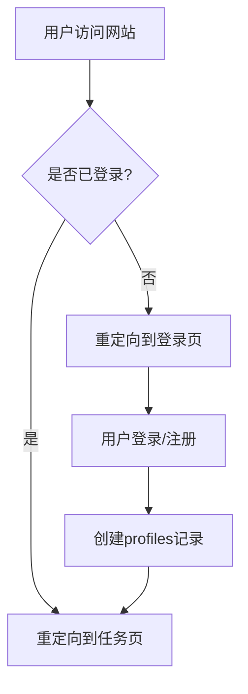
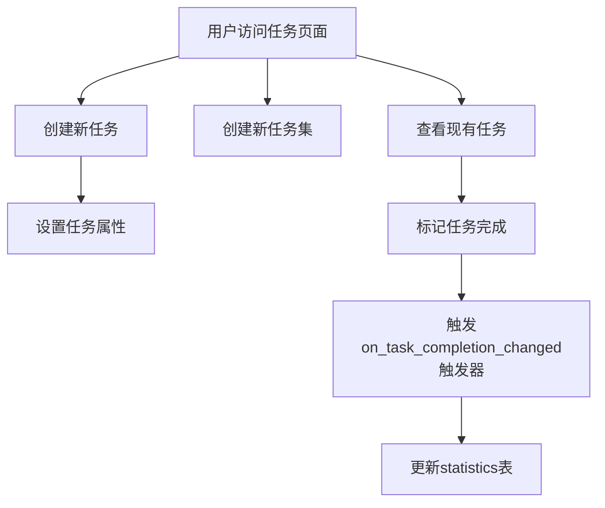
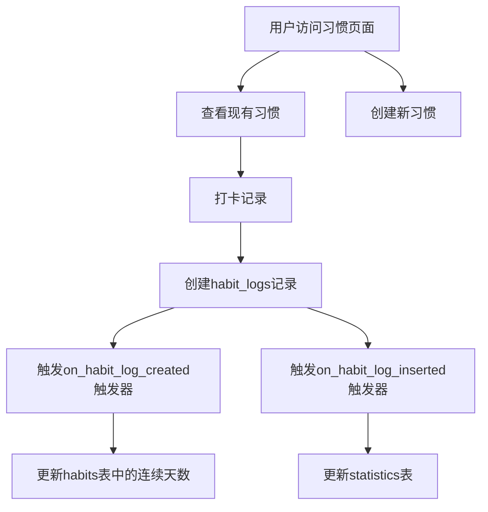
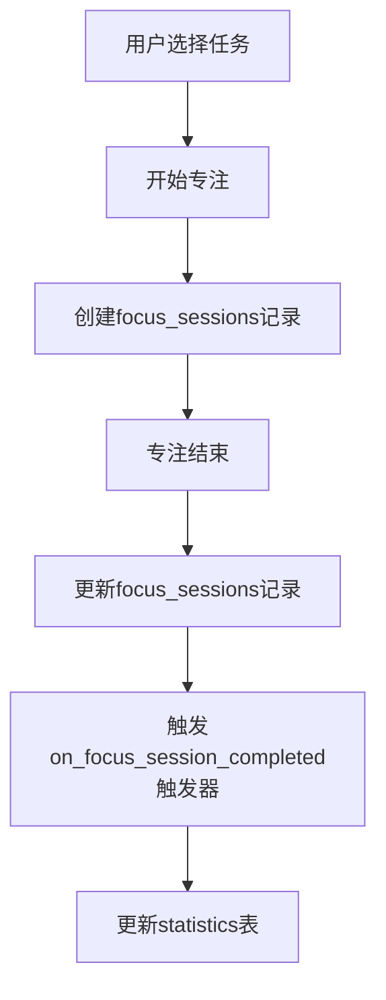
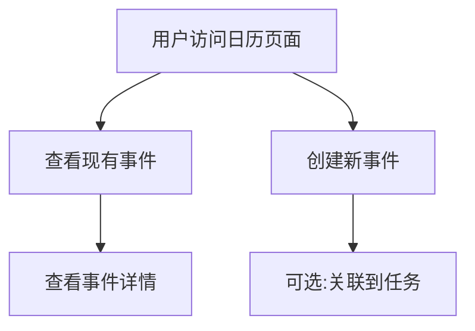
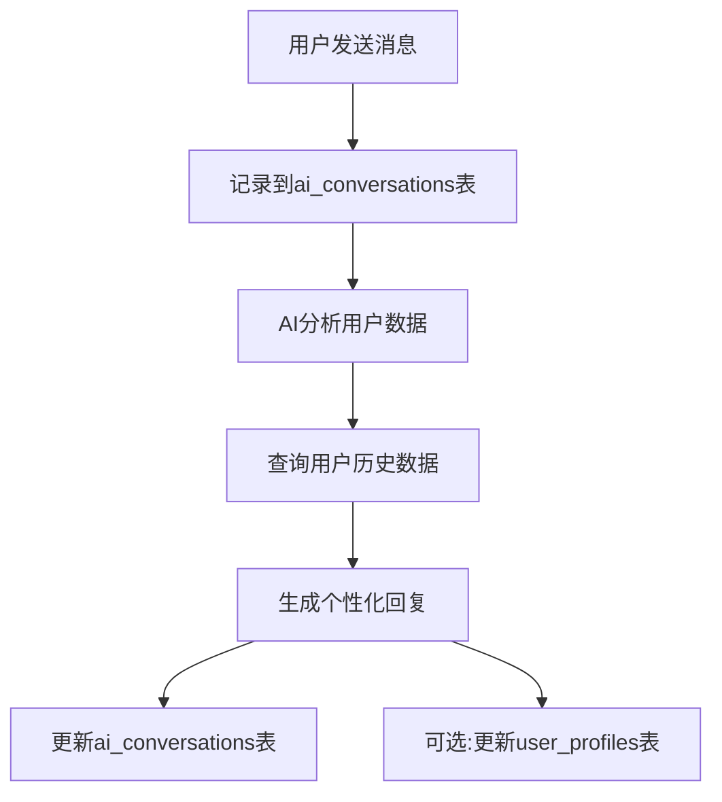
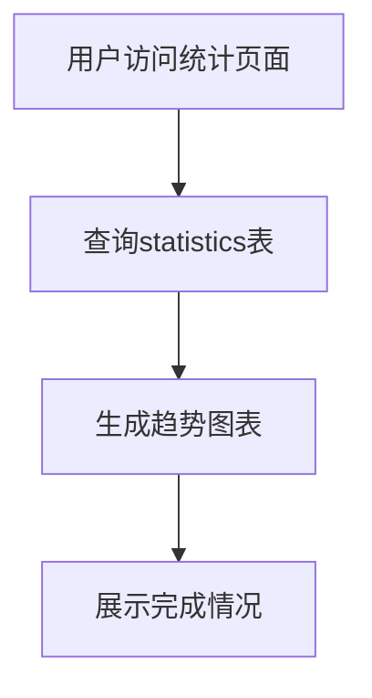
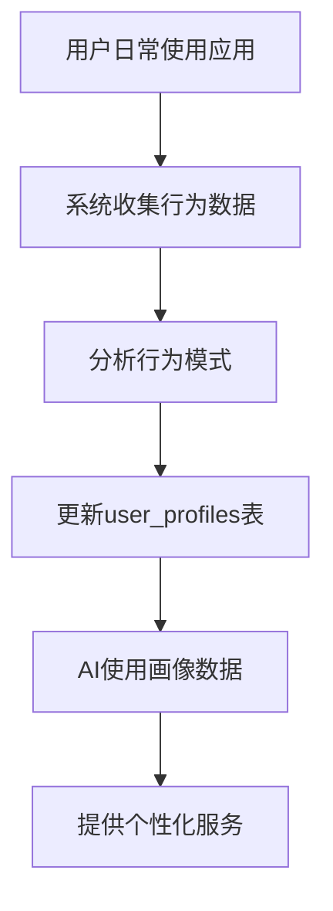
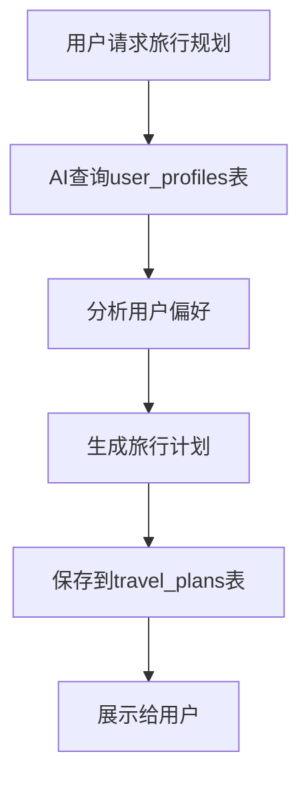

# SuperTimer 产品功能执行流程

根据您的数据库设计和相关SQL文件，我将为您展示SuperTimer应用的主要功能执行流程。

## 1. 用户注册与登录流程

1. 用户通过Supabase Auth进行注册/登录
2. 登录成功后，触发`handle_new_user`函数自动创建用户个人资料
3. 用户被重定向到任务页面（通过middleware.ts中的路由保护）

## 2. 任务管理流程

1. 用户创建任务集（分类）
2. 用户在任务集中创建任务
3. 用户可以设置任务优先级、紧急性和重要性
4. 用户完成任务后标记为已完成
5. 系统自动更新统计数据

## 3. 习惯追踪流程

1. 用户创建习惯（设置频率、图标等）
2. 用户每天打卡记录习惯完成情况
3. 系统自动计算连续打卡天数
4. 系统更新统计数据

## 4. 专注时间管理流程

1. 用户选择任务开始专注
2. 系统记录专注开始时间
3. 用户完成专注后，系统记录结束时间
4. 系统更新统计数据

## 5. 日历事件管理流程

1. 用户创建日历事件
2. 用户可以将事件关联到特定任务
3. 系统在日历视图中展示事件和任务

## 6. AI助手交互流程

1. 用户向AI助手发送消息
2. 系统记录对话内容
3. AI分析用户数据和行为模式
4. AI提供个性化建议和鼓励

## 7. 统计分析流程

1. 系统自动记录用户每日完成的任务、习惯和专注时间
2. 用户可以查看统计数据和趋势图表

## 8. 用户画像构建流程

1. 系统分析用户行为模式
2. 系统更新用户画像数据
3. AI助手使用用户画像提供个性化服务

## 9. 旅行规划功能流程

1. 用户请求旅行规划
2. AI助手分析用户画像和偏好
3. AI生成个性化旅行计划
4. 系统保存旅行计划

这些流程展示了SuperTimer应用如何利用Supabase数据库实现任务管理、习惯追踪、AI助手等核心功能，以及如何通过触发器和RLS策略确保数据安全和自动化统计。