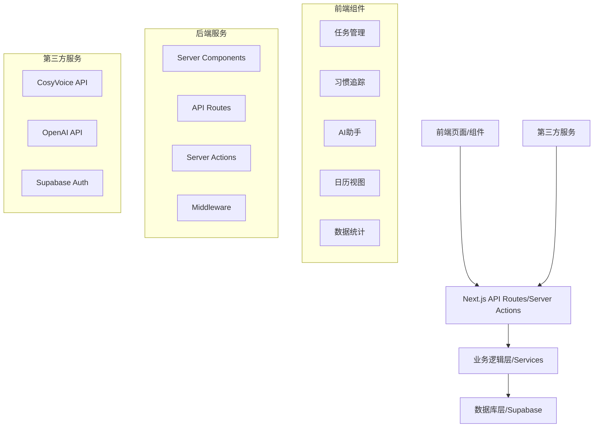
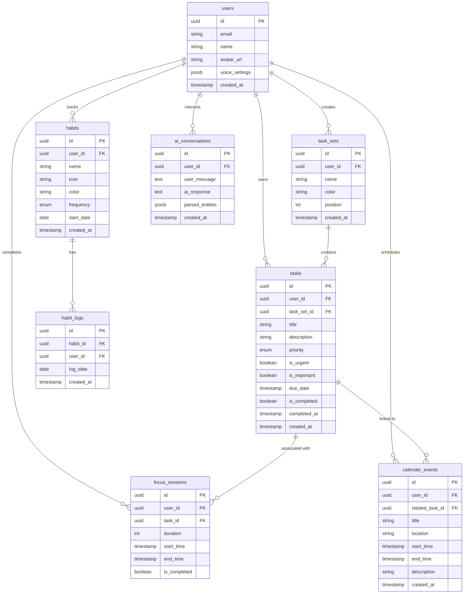
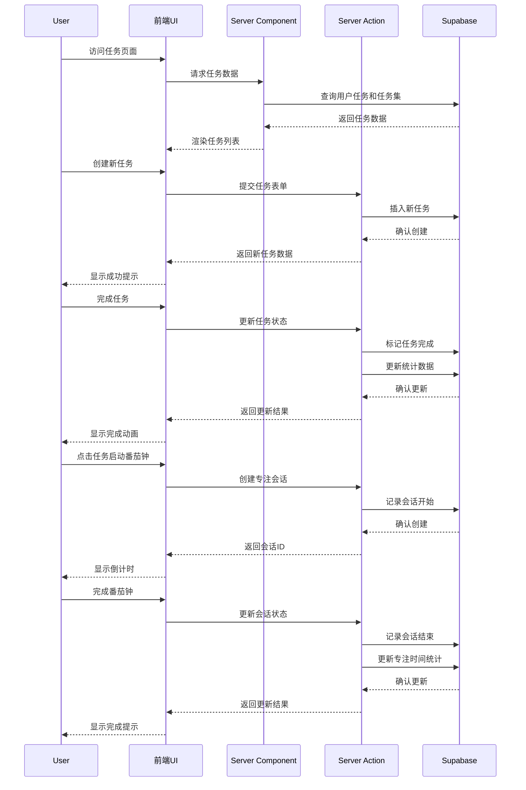
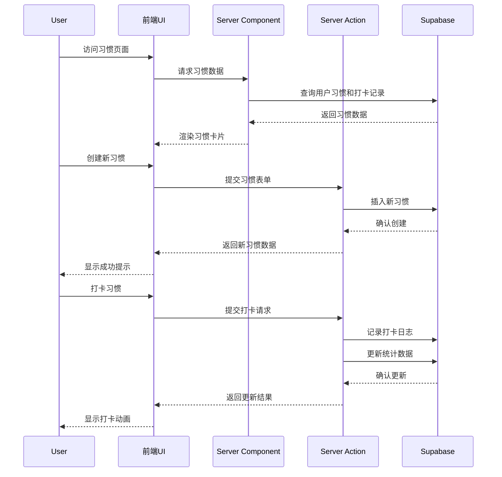
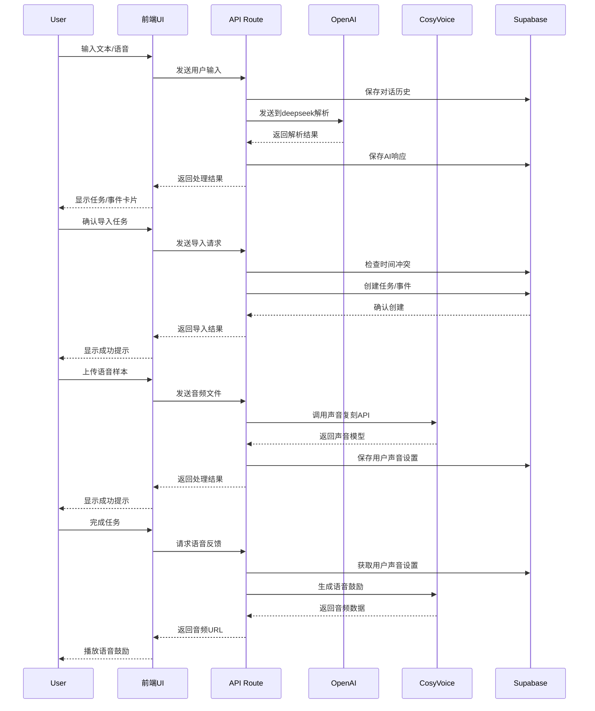
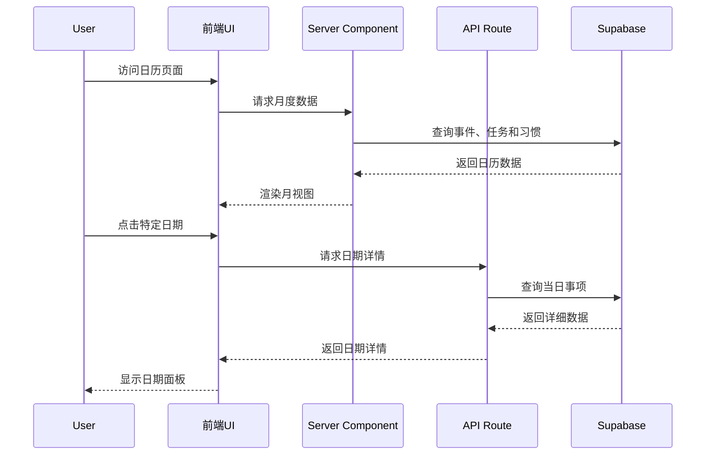
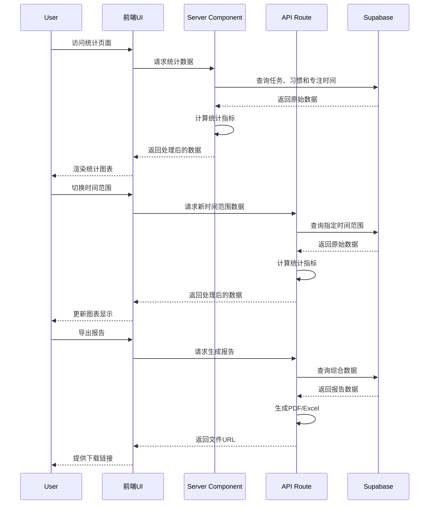

# SuperTimer 应用系统设计与架构

基于您提供的产品原型和架构建议，我整合了一个更完整的系统设计方案，专注于 Next.js 框架下的实现。

## 系统整体架构



Next.js 的全栈特性使我们能够在同一代码库中处理前端渲染和后端逻辑，通过 Server Components、API Routes 和 Server Actions 实现无缝集成。

## 核心数据模型

基于产品需求，我们设计以下核心数据模型：



## API 路由设计

Next.js App Router 架构下的 API 路由设计：

```
app/
├── api/
│   ├── tasks/
│   │   ├── route.ts                # GET, POST 任务列表
│   │   ├── [id]/
│   │   │   ├── route.ts            # GET, PUT, DELETE 单个任务
│   │   │   └── complete/
│   │   │       └── route.ts        # POST 完成任务
│   │   └── sets/
│   │       ├── route.ts            # GET, POST 任务集
│   │       └── [id]/
│   │           └── route.ts        # GET, PUT, DELETE 单个任务集
│   │
│   ├── habits/
│   │   ├── route.ts                # GET, POST 习惯列表
│   │   ├── [id]/
│   │   │   ├── route.ts            # GET, PUT, DELETE 单个习惯
│   │   │   └── log/
│   │   │       └── route.ts        # POST 习惯打卡
│   │   └── stats/
│   │       └── route.ts            # GET 习惯统计
│   │
│   ├── ai/
│   │   ├── chat/
│   │   │   └── route.ts            # POST AI对话
│   │   ├── voice/
│   │   │   ├── clone/
│   │   │   │   └── route.ts        # POST 声音复刻
│   │   │   └── synthesize/
│   │   │       └── route.ts        # POST 文本转语音
│   │   └── import/
│   │       └── route.ts            # POST 导入AI解析结果
│   │
│   ├── calendar/
│   │   ├── route.ts                # GET, POST 日历事件
│   │   ├── [id]/
│   │   │   └── route.ts            # GET, PUT, DELETE 单个事件
│   │   └── day/
│   │       └── [date]/
│   │           └── route.ts        # GET 特定日期事件
│   │
│   └── stats/
│       ├── daily/
│       │   └── route.ts            # GET 每日统计
│       ├── weekly/
│       │   └── route.ts            # GET 每周统计
│       ├── monthly/
│       │   └── route.ts            # GET 每月统计
│       └── export/
│           └── route.ts            # GET 导出报告
```

## 服务器操作 (Server Actions)

除了 API 路由外，我们还可以使用 Server Actions 处理表单提交和数据修改：

```
app/
├── actions/
│   ├── tasks.ts                    # 任务相关操作
│   ├── habits.ts                   # 习惯相关操作
│   ├── ai-assistant.ts             # AI助手相关操作
│   ├── calendar.ts                 # 日历相关操作
│   └── stats.ts                    # 统计相关操作
```

## 模块功能与后端交互流程

### 1. 任务管理模块



### 2. 习惯追踪模块



### 3. AI 秘书模块



### 4. 日历模块



### 5. 统计模块



## 技术实现细节

### 1. 前端技术栈

- **框架**: Next.js 14 (App Router)
- **样式**: TailwindCSS + shadcn/ui 组件库
- **状态管理**: React Context + SWR/React Query
- **动画**: Framer Motion
- **图表**: Chart.js / D3.js
- **表单处理**: React Hook Form + Zod

### 2. 后端技术栈

- **服务器框架**: Next.js API Routes + Server Actions
- **数据库**: Supabase (PostgreSQL)
- **认证**: Supabase Auth
- **ORM**: Prisma (可选)
- **AI 服务**: OpenAI API
- **语音服务**: CosyVoice API
- **文件存储**: Supabase Storage

### 3. 部署与基础设施

- **托管平台**: Vercel
- **数据库托管**: Supabase
- **监控**: Vercel Analytics + Sentry
- **CI/CD**: GitHub Actions

### 4. 性能优化策略

- **静态生成与增量静态再生成 (ISR)**: 对统计页面等相对静态的内容
- **服务器组件**: 减少客户端 JavaScript 体积
- **流式渲染**: 对大型数据集的渲染
- **图片优化**: Next.js Image 组件
- **边缘函数**: 处理 AI 相关请求
- **数据预取与缓存**: SWR/React Query

### 5. 安全考虑

- **认证**: Supabase Auth + JWT
- **授权**: 行级安全策略 (RLS)
- **API 保护**: 速率限制 + CORS
- **数据验证**: Zod 模式验证
- **敏感数据处理**: 环境变量 + 加密存储

## 总结

这个系统设计充分利用了 Next.js 的全栈特性，结合 Supabase 提供的数据库和认证服务，为 SuperTimer 应用提供了一个可扩展、高性能的架构。通过服务器组件和服务器操作，我们可以在保持良好用户体验的同时，减少客户端 JavaScript 的体积，提高应用性能。

该设计考虑了应用的所有核心功能，包括任务管理、习惯追踪、AI 助手、日历视图和数据统计，并为每个功能模块提供了清晰的数据流和交互逻辑。同时，我们也考虑了性能优化和安全性，确保应用能够安全、高效地运行。